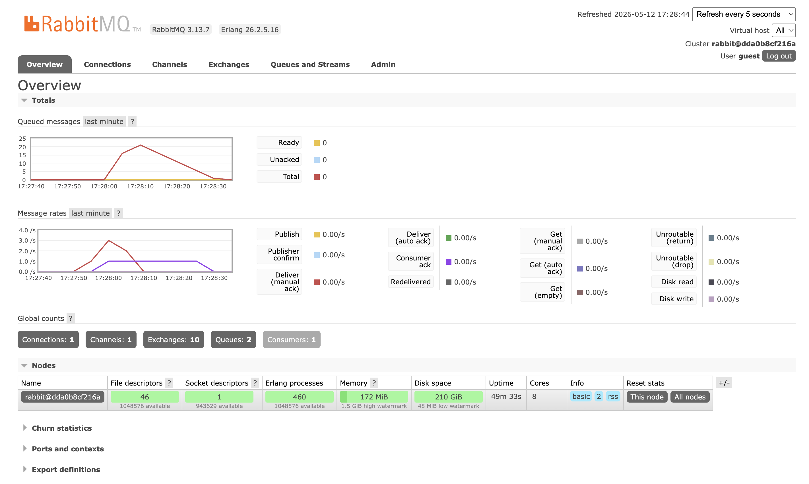

# Reflection

## What is AMQP?

AMQP stands for Advanced Message Queuing Protocol. It is a protocol used by message brokers, such as RabbitMQ, to let applications send and receive messages through queues.

## What does it mean? guest:guest@localhost:5672 , what is the first guest, and what is the second guest, and what is localhost:5672 is for?

In "guest:guest@localhost:5672", the first "guest" is the username used to log in to RabbitMQ. The second "guest" is the password for that username. "localhost:5672" means the RabbitMQ server is running on the local computer, and the application connects to it through port "5672", which is the default AMQP port.

## Simulation Slow Subscriber

In my run, RabbitMQ shows `Queues: 2` in the global counts. The first queue is `user_created`, which is the main queue used by the publisher to send events and by the subscriber to consume them. The second queue is `user_created_dead_letter`, which is created because the subscriber uses `QueueProperties { use_dead_letter: true }`.

The queued messages chart shows a different number. In the screenshot, the total queued messages briefly spikes to around 20-21 messages. This happens because I ran the publisher several times quickly while the subscriber was slowed down with `thread::sleep(ten_millis)`. Each publisher run sends 5 events, so repeated runs can add messages faster than the subscriber can process them. The messages temporarily pile up in the `user_created` queue, then the number goes back down as the subscriber processes them one by one.
